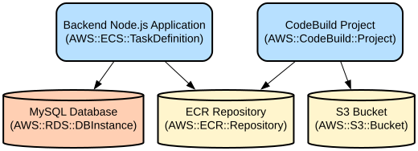

# My Little Recipe Book - Smart Recipe Management with Ingredient-Based Search

My Little Recipe Book is a Node.js-based recipe management system that helps users discover recipes based on available ingredients, manage bookmarks, and receive personalized recipe recommendations. The application features intelligent search capabilities, ingredient filtering, and user preference management to provide a tailored cooking experience.

The system provides a comprehensive recipe management solution with features like ingredient-based search, recipe bookmarking, personalized recommendations based on user preferences, and refrigerator ingredient tracking. It integrates with multiple authentication providers (Kakao, Naver, Google) and supports subscription-based features for enhanced user experience.

## Repository Structure
```
.
├── app.js                      # Main application entry point, sets up Express server and routes
├── models/                     # Database models and schemas
│   ├── bookmark.js            # Bookmark relationship between users and recipes
│   ├── ingredient.js          # Ingredient definitions and relationships
│   ├── recipe.js             # Recipe schema and relationships
│   ├── refrigerator.js       # User's refrigerator management
│   ├── searchFilter.js       # User's ingredient search preferences
│   └── user.js               # User profile and authentication
├── routes/                    # API route handlers
│   ├── auth.js               # Authentication routes (Kakao, Naver, Google)
│   ├── bookmark.js           # Recipe bookmarking functionality
│   ├── recipe.js            # Recipe CRUD operations
│   ├── search.js            # Recipe search functionality
│   └── searchFilter.js       # Search filter management
├── scripts/                   # Database connection and utility scripts
│   └── connector.js          # MySQL database connection configuration
└── utils/                    # Utility functions
    ├── logUtils.js           # Logging utilities
    └── sessionUtils.js       # Session management utilities
```

## Usage Instructions
### Prerequisites
- Node.js 18.19.1 or higher
- MySQL 5.7 or higher
- Docker (for containerized deployment)
- Environment variables configured in `.env`:
  ```
  MYSQL_HOST=<database-host>
  MYSQL_USER=<database-user>
  MYSQL_PASSWORD=<database-password>
  MYSQL_DATABASE=<database-name>
  PORT=3000
  ```

### Installation

```bash
# Clone the repository
git clone <repository-url>

# Install dependencies
npm install

# Configure environment variables
cp .env.example .env
# Edit .env with your configuration

# Start the application
npm start
```

For Docker deployment:
```bash
# Build Docker image
docker build -t my-little-recipebook .

# Run container
docker run -p 3000:3000 --env-file .env my-little-recipebook
```

### Quick Start
1. Start the server:
```bash
npm start
```

2. Make API requests to available endpoints:
```bash
# Search recipes by ingredients
POST /search/getIngredientSearchList
{
  "keyword": "chicken",
  "type": "page"
}

# Get user bookmarks
POST /bookmark/getBookmark
{
  "user_id": "user123",
  "access_token": "token123"
}
```

### More Detailed Examples
1. Search recipes with excluded ingredients:
```bash
POST /search/getFilteredSearchList
{
  "keyword": "pasta",
  "type": "page",
  "keyword_filter": ["mushroom", "garlic"]
}
```

2. Manage refrigerator contents:
```bash
POST /refrig/updateIngredients
{
  "user_id": "user123",
  "access_token": "token123",
  "refrigerator_id": 1,
  "ingredients": [
    {
      "name": "milk",
      "expiry_date": "2024-02-28"
    }
  ]
}
```

### Troubleshooting
1. Database Connection Issues
   - Error: "Database connection was refused"
   - Check if MySQL server is running
   - Verify database credentials in .env
   - Ensure database host is accessible

2. Authentication Errors
   - Error: "user_id and access_token do not match"
   - Verify token validity
   - Check session expiration
   - Ensure proper OAuth configuration

## Data Flow
The application processes recipe searches and user interactions through a multi-step flow that ensures data consistency and user authorization.

```ascii
User Request → Auth Validation → Database Query → Data Transform → Response
     ↑              |               |                  |            |
     └──────────────┴───────────────┴──────────────---┴────────────┘
```

Key component interactions:
- Authentication middleware validates user sessions before processing requests
- Database queries are executed through connection pool for better performance
- Search operations combine multiple tables for comprehensive results
- Bookmarks and preferences are maintained in separate tables for modularity
- Error handling and logging occur at each step of the process

## Infrastructure


The application is deployed using a containerized approach with the following resources:

### Container Registry
- Harbor Registry (Development)
- Amazon ECR (Production)

### CI/CD
- GitHub Actions workflow for development deployments
- AWS CodeBuild for production builds
- GitOps repository for deployment configurations

### Deployment
- Kubernetes-based deployment using deployment manifests
- Automated image updates through CI/CD pipelines
- Slack notifications for build status updates